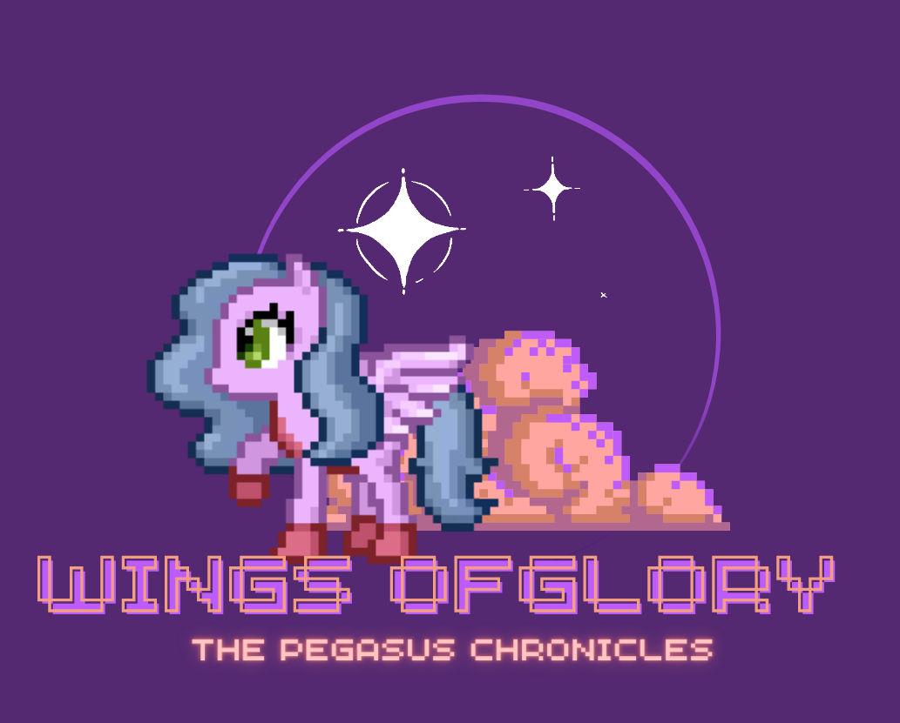

# **Game Authors**
Arantza Parra Martínez A01782013

Emilia Salazar Leipen A01781931

Lucía Barrenechea A01782021

Maria Fernanda Cortés Lozano A01026613

Maria Fernanda Osorio Arroyo A01026502

# **Toby's Quest for Wings**

## _Game Design Document_

---

##### **Copyright notice / author information / boring legal stuff nobody likes**

##
## _Index_

---

1. [Index](#index)
2. [Game Design](#game-design)
    1. [Summary](#summary)
    2. [Gameplay](#gameplay)
    3. [Mindset](#mindset)
3. [Technical](#technical)
    1. [Screens](#screens)
    2. [Controls](#controls)
    3. [Mechanics](#mechanics)
4. [Level Design](#level-design)
    1. [Themes](#themes)
        1. Ambience
        2. Objects
            1. Ambient
            2. Interactive
        3. Challenges
    2. [Game Flow](#game-flow)
5. [Development](#development)
    1. [Abstract Classes](#abstract-classes--components)
    2. [Derived Classes](#derived-classes--component-compositions)
6. [Graphics](#graphics)
    1. [Style Attributes](#style-attributes)
    2. [Graphics Needed](#graphics-needed)
7. [Sounds/Music](#soundsmusic)
    1. [Style Attributes](#style-attributes-1)
    2. [Sounds Needed](#sounds-needed)
    3. [Music Needed](#music-needed)
8. [Schedule](#schedule)

## _Game Design_
#### **Elevator pitch**
Toby is a pegasus that fell into the trap of an evil equine shapeshifter, one day he found a golden apple and decided to eat it. What he didn’t know was that this apple was part of the trap and it would make him fall from his magical pegasus world into the ordinary mule world. Join Toby on his quest to return to his family.</
 
While on his quest Toby will face 5 different stages, the first being a mule. Navigating through the adventure he will have to collect valuable items, overcome obstacles, and play a strategic game in order to defeat the evil mule. If the player manages to win the battle, he will evolve into a donkey, starting a new quest with increased difficulty to defeat the evil donkey. This same gameplay will apply throughout each level, mule, donkey, horse, unicorn and pegasus, increasing the difficulty to overcome the obstacles, collect items and a need for strategy.  

### **Game Genre**
The game  genre is RPG which means it is a role playing game. The player will have a series of choices to make along the game which will determine the final outcome. The game is not linear.

### **RPG Elements**
At the beginning of the game the player will have the choice to choose their armor. Each armor will give the player different abilities and weaknesses which will determine the way the player plays the game. The gadgets will give extra abilities and will increase or decrease the initial abilities given to the player. Inside the game the player will find a non-player character called “flower”. The flower will explain certain aspects of the game and it will hint the weaknesses of the enemy to the player. The game will also have an owl that will lead Toby throughout the game. The player will now have to create a strategy that will lead to his victory. 

### **List of stats that will be compiled during the game**
Databases will partake in our video game development. Data such as lives lost, prizes recollected, levels overcome and user data will be not only useful but necessary. 
 Creating and using a database will allow us to develop a fully functional system. This system must function using relative databases in order to avoid redundancy in the data or a superfluous amount of data that could be detrimental to the main functions of the database. 

 
In the game we will receive information that it is essential for the game to work. Since the outcome of our game is based on the accumulation of points, it is necessary to create a database that contains the points accumulated as well as important information. Some of the statistics that will be saved throughout the game are the following:
1. Player information.
2. Quantity and quality of the items collected throughout the game by the user.
3. The location of the player in the game.
4. Game history of the player.
5. Points accumulated by the player in each level and throughout the game.
6. Data on player abilities. (Furthered explained on Technical)
6. The rules of the game: how to lose a life, how to earn points, etc.

### **Summary**

In this game, you play as Toby, a pegasus who fell for a trick and was transformed into a mule. To return to his family, Toby must fight through levels of different transformations, collect items, and defeat enemies using weapons and shields. The game has a single-player, sideways view, and features five levels of increasing difficulty.

### **Gameplay**

- The goal of the game is for Toby, the protagonist, to make his way back to his family of pegasus; starting from a mule. In order to do this he must navigate through five different levels and defeat an enemy at the end of each. If he succeeds, he will evolve into a new character as he levels up. He must  transform from a mule to a donkey, to a horse, to a unicorn, and finally to a pegasus all while being chased by his enemies. While navigating through each level, the player must collect items such as gems, fruit and weapons, as well as overcome obstacles such as spikes, lava and pools of poison, in order to gather enough materials to eventually defeat the enemy. The player must create a strategy to succesfully use the items collected and the path taken to achieve the most points at the end of the level, in order to be ranked as a top pegasus. 

- There will be a dungeon on each level where the player can obtain special items that will increase their chance at defeating the enemy. The player can decide if they go in or not. If the player loses in the dungeon, they will lose the items they had previously collected and they will be sent back to a checkpoint in the normal world. The player should also be strategic in their use of Toby's limited lives and resources to ensure they make it through the level.
The items play a crucial role in the game since the combination of said items can improve the possibilities for the player to defeat the enemy. If the player is not strategic with the combination he made, he will lose the fight against the enemy. Each item will have different advantages and disadvantages. The player must consider what he needs to overcome the challenges presented in the game.

At the final step of the game, Toby will have to confront his enemy. He will be faced with a fight that he can only win if he collected enough valuable gadgets. In order for Toby to win the fight he must be strong enough. To achieve this he must collect gadgets that will give him specific abilities that will help him beat his enemy. 
 
 <!-- Another factor that the player should be cautious about is the pace they keep while going through the level because they will always have an enemy on their backs. If the enemy catches up with them, they lose a life.  -->
### **Mindset**

- The mindset we want to create for the players is for them to have a sense of need to reunite Toby with his family. As they level up and unlock new features, we want them to feel like they are becoming stronger and more capable of overcoming challenges. As the player increases the level, we want to challenge them with tough enemies and obstacles that will require them to think carefully about their tactics and strategies. The player will have to weight cons and pros of each gadget to get the best combination possible. He will be presented with a series of decisions that will change the outcome of the game. This will give the player the sense that he is in control of his destiny, Overall, the goal is to create a game that is engaging and immersive, that will make the player want to keep coming back for more. Always keeping the game balanced between the sense of achievement and the need to win challenges.

### **Screens**
1. Title Screen
    1. Options
2. Level Select
3. Game
    1. Inventory
    2. Assessment / Next Level
4. End Credits

_(example)_

## **Mechanics**
While playing the game, the player will be ranked on a point basis, each battle winned will increase their points as well as each life lost and the way it was lost will decrease points. When reaching the final stage of the quest and becoming the pegasus, Toby will evolve into one of the five ranks of pegasus, depending the points accumulated by the player, making the game scalable and leaving the player with the need to keep playing and changing their strategy each time in order to play a perfect game and become the Supreme Pegasus. 
The main objective of the game is for Toby to eventually reach his family. To do this he must travel through 5 different worlds (levels). At the end of each level Toby will have to fight his enemy. To do this he will have to use the gadgets collected throughout the level. Toby will also be able to use the gadgets in the level to facilitate the game. The player will have 3 lives throughout each level. If the player loses them all it’s game over.

### **Controls**
- The player will interact with the game using standard platformer controls, such as moving left and right, jumping, tapping, and attacking. In-game events can be triggered by the player through various actions such as attacking enemies, collecting items, and reaching specific points in the level. Additionally, the player may have to solve puzzles to progress through the game, which would require interacting with the environment and manipulating objects in various ways.

### **Habilities**
In the game Toby will have 4 different habilities that will help him reach his objective.
These are the following:

- Strength
- Agility
- Shield
- Speed

These abilities will be displayed in the screen at all times throughout the game. The combination of gadgets will change the amount of ability that Toby has under his disposal. If Toby has 0 ability in one of the four habilities, his life will start to decrease. Toby has to collect more gadgets to stop this from happening.

### **The Gadgets**
To have a greater chance, as Toby goes through the course he will collect different gadgets that will make him stronger in the final battle. Some gadgets will be used throughout the game since they will help Toby collect even better gadgets and get throught the killer sprites. In order to get the best gadgets, the player will have the choice to access “the dungeon”. 

Category|Gadget|Pros|Cons
 -|-|-|-
 Food|||
 1|Carrot|Agility+++|Shield -
 2|Apple|Agility++|Shield -
 3|Cake|Agility+|Shield -
 Horse Shoe|||
 1|Spike Shoe|Strength+++|Agility -
 2|Fire Shoe|Strength++|Agility -
 3|Skates|Strength+|Agility -
 Armor|||
 1|Gold|Shield+++|Speed -
 2|Silver|Shield++|Speed -
 3|Bronze|Shield+|Speed -
 Headset|||
 1|Crown|Speed+++|Strength -
 2|Hat|Speed++|Strength -
 3|Hair band|Speed+|Strength -

Each gadget mentioned before will aditioinally contain extra habilities. These habilities will not be known to the player since they will be determined randomly.

### **Killer Sprites**
As Toby traverses through each level he will face threats such as spikes, acid pool and lava pool. If the player touches any of these, he will die. He will reappear next to the killer sprite with the ability used reduced.

The amount of ability needed to overcome the killer sprites will vary each time. The user will be presented with the option to try or not. If the player is succesful, the ability used will increase. if the player is killed, he will loose of the ability used in the task. Each task will have different requirements of ability that will be unknown to the user. The user will only have a range of possible requirements.

Name|How to overcome|Message Displayed
 -|-|-
 Killer Sprites||
 Bomb| To sucessfully move the rock the player will have to use his strength.| Is you armor strong enough to protect you from the blast?
 Pool|To go through the pool the player will need to use his speed.| Are you fast enough to walk through water?
 Iceicles| To go under the iceicles the player will use his agility.| Are you agile enough to dodge the iceicles?
 Rock|To move the rock the player will use his strength. Moving the rock will unblock a path.| Are you strong enough to move the rock?

### **The Dungeon**
In the dungeon better gadgets will exist. Inside the dungeon, Toby will have to cross through a series of obstacles to reach a powerful gadget. He will have to choose from 3 possible options. There is one thing that the player must take into consideration, if he loses a life inside the dungeon, he will also lose all of the gadgets he has collected. Each dungeon can only be accessed once by the player.

### **How to Lose a Life**
It is important that the player understands that they have 3 lives through each level. if they lose all 3, they will start from the beginning with nothing.
    There are 3 possibilities for the player to lose a life in the game. These are the following:
1. If one of the habilities tanks is empty, the life tank will start to decrease.
2. If you get caught inside the dungeon, you will lose a life and you will lose all of the gadgets collected. The player will reappear next to the dungeon.
3. If you don’t have the necessary gadgets to beat Toby's enemy at the final stage of the game, you will lose a life and the gadgets you used trying to win. If you have extra lives and extra gadgets, you can fight once again.   

### **The Final Battle**
The final battle is the most important aspect of the game. Here, Toby will confront his enemy in an epic battle. He will have to put to use all of the gadgets that he collected along the level as well as his strategies. Toby will have to create gadget combinations that will uncover the enemies weakness. The player will have to strategize the best way to defeat the enemy. The player will have hints of the enemies weakness in the level. Whoever loses his life first, either Toby or the enemy, will loose the battle.
#### **How will the battle work?**
The fight will work the following way:
1. The fight will work with turns. Toby will attack first and later the enemy.
2. Toby's attack: The player will use the gadgets collected as well as his strategy to combat the enemey. The player must use the enemies weaknesses against him. After the player chooses his attack, he will have a time limit to build up his energy. He will have to press on the spacebar. The greater the presses, the greater the energy. Toby will punch the enemy. His atack will lower the enemies life.
3. Enemies attack: The enemy will attack Toby with a series of punches. This will lower toby's life.

## _Technical_
### How will point accumulation work?
<!-- Emo aqui escribe la matematica de la puntuación -->
The point accumulation will be based on a range basis. As shown previously, depending on each section of the armour, there are three items available for each and each item will give the player an advantage on a certain skill as well as a disadvantage. Each item will have a range of points that can be given or substracted, this points will be randomized during the game. This will allow the player to have a different experience each time they play the game. The points will be given as follows:
## Food
|       | Strength | Agility | Shield | Speed |
|-------|----------|---------|--------|-------|
| Carrot| (-2,2)   | (7,8)   | (-5,-6)| (-2,2)|
| Apple | (-2,2)   | (5,6)   | (-3,-4)| (-2,2)|
| Cake  | (-2,2)   | (3,4)   | (-1,-2)| (-2,2)|

## Horse Shoe
|          | Strength | Agility | Shield | Speed |
|----------|----------|---------|--------|-------|
| Spike Shoe| (7,8)    | (-5,-6) | (-2,2) | (-2,2)|
| Fire Shoe | (5,6)    | (-3,-4) | (-2,2) | (-2,2)|
| Fire Shoe | (3,4)    | (-1,-2) | (-2,2) | (-2,2)|

## Armor
|      | Strength | Agility | Shield | Speed   |
|------|----------|---------|--------|---------|
| Gold | (2,-2)   | (-2,2)  | (7,8)  | (-5,-6) |
| Silver| (2,-2)   | (-2,2)  | (5,6)  | (-3,-4) |
| Bronze| (2,-2)   | (-2,2)  | (3,4)  | (-1,-2) |

##  Headset
|       | Strength | Agility | Shield | Speed   |
|-------|----------|---------|--------|---------|
| Crown | (-5,-6)  | (-2,2)  | (-2,2) | (7,8)   |
| Hat   | (-3,-4)  | (-2,2)  | (-2,2) | (5,6)   |
| Hairband|(-1,-2)  | (-2,2)  | (-2,2) | (3,4)   |

## Obstacles
| Items     | Ability Needed | Consequence                                            |
|-----------|----------------|--------------------------------------------------------|
| Bomb      | Shield: 5-9    | The item with the most amount of shield value is taken |
| Pool      | Speed: 5-9     | The item with the most amount of speed value is taken  |
| Iceicles  | Agility: 5-9   | The item with the most amount of agility value is taken|
| Rock      | Strength: 5-9  | The item with the most amount of strength value is taken|

## Evil Player 

| Evil Equines Stats | Strengths       | Weaknesses        | 
|--------------------|----------------|-------------------|
|                    | 0 - 2          | 6 - -10            | 
| Evil Mule          | Strength          | Shield     | 
|                    |                |                   |    
|                    | 0 - 4          | -8 - -4           | 
| Evil Donkey        | Speed       | Agility           | 
|                    |                |                   |            
|                    | 2 - 6          | -6 - -2           | 
| Evil Horse         | Shield | Strength          | 
|                    |                |                   |              
|                    | 4 - 8          | -4 - -0           | 
| Evil Unicorn       | Agility | Speed          | 
|                    |                |                   |              
|                    | 6 - 10         | -2 - -0          |
| Evil Pegasus       | Speed | Agility           | 

---

## Initial Armor
|        | Strength | Shield | Speed | Agility |
|--------|----------|--------|-------|---------|
| Pink   | (-2,-2)  | (0,-5) | (0,-3)| (-1,3)  |
| Green  | (0,-5)   | (-2,2) | (-1,3)| (0,-3)  |
| Blue   | (-1,3)   | (0,-3) | (-2,2)| (0,-5)  |

## _Level Design_
---
### Level Details
#### Level 1
Characters|Details
 -|-
  Toby Mule| Toby will be in the form of a mule during the level.
  Enemy Mule| The enemy will be in the form of a mule. His main weakness will be  based around Shield and his strength will be stregth.

#### Level 2
Characters|Details
 -|-
  Toby Donkey| Toby will be in the form of a donkey during the level.
  Enemy Donkey| The enemy will be in the form of a donkey. His main weakness will be  based around agility and his strength will be speed.

#### Level 3
Characters|Details
 -|-
  Toby Horse| Toby will be in the form of a horse during the level.
  Enemy Horse| The enemy will be in the form of a horse. His main weakness will be  based around strength and his strength will be shield.

#### Level 4
Characters|Details
 -|-
  Toby Unicorn| Toby will be in the form of a unicorn during the level.
  Enemy Unicorn| The enemy will be in the form of a unicorn. His main weakness will be  based around speed and his strength will be agility.

#### Level 5
Characters|Details
 -|-
  Toby Pegasus| Toby will be in the form of a pegasus during the level.
  Enemy Pegasus| The enemy will be in the form of a pegasus. His main weakness will be  based around agility and his strength will be speed.

### **Themes**

1. Prarie
    1. Mood
        1. Joyful, Calm, Mystic
  2. Objects
        1. _Ambient_
            1. Flowers
            2. Grass
            3. Stones
        2. _Interactive_
            1. NPC: flower
2. Haystack
    1. Mood
        1. Dry, Calm, Lonely
    2. Objects
        1. _Ambient_
            1. Blocks of hay
            2. Blocks of mud
            3. Cloudy
        2. _Interactive_
            1. NPC: flower

3. Mountain
    1. Mood
        1. Cold, Fun, Cloudy
    2. Objects
        1. _Ambient_
            1. Trees
            2. Rocks
            3. Flowers
        2. _Interactive_
            1. NPC: flower

4. Rainbow sky
    1. Mood
        1. Colorful, Playful, Happy
    2. Objects
        1. _Ambient_
            1. Rainbow
            2. Gold
            3. Shiny clouds
        2. _Interactive_
            1. NPC: flower

5. Heaven
    1. Mood
        1. Glorious, Mystical, Fun
    2. Objects
        1. _Ambient_
            1. Shiny Clouds
            2. Gold
            3. Rays of light
            4. lightning
        2. _Interactive_
            1. NPC: flower
### **Game Flow**

1. Player starts in prarie
2. Pond to the left, must move right
3. To the right is a hill, player jumps to traverse it (&quot;jump&quot; taught)
4. Player encounters castle - door&#39;s shut and locked
5. There&#39;s a window within jump height, and a rock on the ground
6. Player picks up rock and throws at glass (&quot;throw&quot; taught)
7. … etc.

_(example)_

## _Development_

---

### **Abstract Classes / Components**

1. BasePhysics
    1. BasePlayer
    2. BaseEnemy
    3. BaseObject
2. BaseStatistics
### **Derived Classes / Component Compositions**

1. BasePlayer
    1. PlayerMule
    2. PlayerDonkey
    3. PlayerHores
    4. PlayerUnicorn
    5. PlayerPegazus
2. BaseEnemy
    1. EnemyMule
    2. EnemyDonkey
    3. EnemyHores
    4. EnemyUnicorn
    5. EnemyPegazus
3. BaseGadgets
    1. food (collectables)
    2. HorseShoe (collectables)
    3. Armor (collectables)
    4. Hats (collectables)
4. BaseAbilities
    1. Strength
    2. Speed
    3. Agility
    4. Armor

## _Graphics_

---

### **Style Attributes**
### **Visual style of the game**
The visual style of the video game will be pixel art. The graphics of the video game will be built with pixels since it is a very basic form and that allows, with relatively few resources, very striking art. It also produces a retro and nostalgic look. 

**Video Game Sketches**

### Main characters: 
#### *Toby*

Toby's Pallette

#### *Enemy*

Enemies's Pallette

- logo:

- sketch of main game scene:

## **References**

We have taken inspiration from different games, their functionalities and views.

This game is called *Fireboy and Watergirl in The Forest Temple*. From this game we have taken the different obstacles the user has to go through in order to reach the end of the level. 
Functionalities such as incentives to go through the obstacles were also taken into account.

The game *Donkey Kong* inspired us for the type of visuals we wanted our game to have. Our characters, as the ones in donkey kong will be made with pixel art. 

What kinds of colors will you be using? Do you have a limited palette to work with? A post-processed HSV map/image? Consistency is key for immersion.

### **Graphics Needed**

1. Characters
    1. Animal-like
        1. Toby (walking, jumping, dead, hitting)
        2. Enemy (walking, jumping, dead, hitting)
        3. Owl (talking, jumping)
    2. Other
        1. flower (right incline, left incline.)
2. Blocks
    1. Dirt/Grass
    2. Stone Block
    3. Stone Blocks with plants
    5. Black hole (purple)
3. Ambient
    1. Lava pool
    2. Acid pool
    3. Deadly spikes
4. Collectable Gadgets
    1. Carrot
    2. Apple
    3. Cake
    4. Spike Shoe
    5. Fire Shoe
    6. Skates
    7. Gold
    8. Silver
    9. Bronze
    10. Hair Band
    11. Hat
    12. Crown

## _Sounds/Music_

---

### **Style Attributes**

Again, consistency is key. Define that consistency here. What kind of instruments do you want to use in your music? Any particular tempo, key? Influences, genre? Mood?

Stylistically, what kind of sound effects are you looking for? Do you want to exaggerate actions with lengthy, cartoony sounds (e.g. mario&#39;s jump), or use just enough to let the player know something happened (e.g. mega man&#39;s landing)? Going for realism? You can use the music style as a bit of a reference too.

 Remember, auditory feedback should stand out from the music and other sound effects so the player hears it well. Volume, panning, and frequency/pitch are all important aspects to consider in both music _and_ sounds - so plan accordingly!

 The game will use

### **Sounds Needed**

1. Effects
    1. Soft Footsteps (dirt floor)
    2. Sharper Footsteps (stone floor)
    3. Soft Landing (low vertical velocity)
    4. Hard Landing (high vertical velocity)
    5. Glass Breaking
    6. Chest Opening
    7. Door Opening
2. Feedback
    1. Relieved &quot;Ahhhh!&quot; (health)
    2. Pain &quot;Ahhhh!&quot;
    3. Happy chime (extra life)
    4. Sad chime (died)

### **Music Needed**

1. Slow-paced, nerve-racking &quot;forest&quot; track
2. Exciting &quot;castle&quot; track
3. Creepy, slow &quot;dungeon&quot; track
4. Happy ending credits track
5. Rick Astley&#39;s hit #1 single &quot;Never Gonna Give You Up&quot;

_(example)_

## _Schedule_

---

_(define the main activities and the expected dates when they should be finished. This is only a reference, and can change as the project is developed)_
1. Create Sprites for our main charcters (sprint 1)
    1. Create sprites for Toby
    2. Create sprites of enemy
2. Create videoGame tilesets (sprint 1) 
3. Design Level 1 (sprint 2)
4. Develop base classes
5. Develop player Movement
7. Create backstory graphics.
8. Develop derived classes
9. Design music and sounds.
10. Test-run finished videogame.

